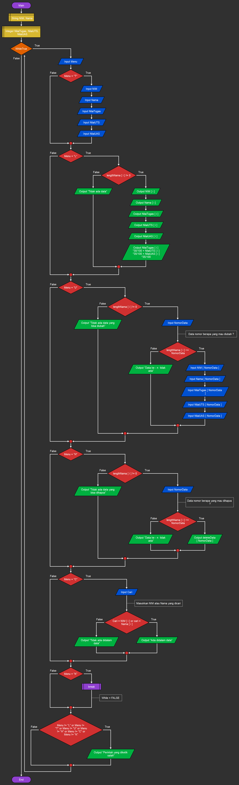

# Latihan membuat dictionary python  

* Nama          : Hizbullah Ridwan
* NIM           : 312110055
* Kelas         : TI.21.C.1
* Mata Kuliah   : Bahasa Pemrograman
----------------------------------
Dalam latihan membuat conditional dan loop [python](https://www.python.org/) ini, saya menggunakan [visual studio code](https://code.visualstudio.com/) sebagai teks editornya.     
    

* [Latihan](https://github.com/Ridwanwildan/Dictionary-Python#latihan)         
* [Tugas](https://github.com/Ridwanwildan/Dictionary-Python#tugas)        


## Latihan         

Mendeklarasikan dictionary yang didalamnya ada ***nama***, ***no*** sebagai key dan ***values*** nya yaitu ***ari***, ***Dina***, ***081267888***, ***087677776*** yang kita masukkan kedalam list.       

```bash
kontak = {
    "nama":["Ari", "Dina"], 
    "no":["081267888", "087677776"]
    }
```         

Untuk menampilkan kontak Ari maka caranya seperti ini :         
```bash
# Tampilkan kontaknya Ari
print(kontak["nama"][0])
print(kontak["no"][0])
```        

Kita bisa menambahkan values yang baru dengan cara seperti ini :       
```bash
# Tambah kontak baru dengan nama Riko, nomor 087654544
kontak["nama"].append("Riko")
kontak["no"].append("087654544")
```         

Untuk mengubah values maka caranya seperti ini :       
```bash
# Ubah kontak Dina dengan nomor baru 088999776
kontak["no"][1] = "088999776"
```        

Jika ingin menampilkan masing-masing values yang sudah kita masukkan maka caranya seperti ini :       
```bash
# Tampilkan semua Nama
print(kontak["nama"])
# Tampilkan semua Nomor
print(kontak["no"])
```        

Dan kalau mau menampilkan key beserta values gunakan cara ini :      
```bash
# Tampilkan daftar Nama dan nomornya
print(kontak)
```         

Terakhir yaitu jika kita ingin menghapus values nya gunakan cara ini :      
```bash
# Hapus kontak Dina
kontak["nama"].remove("Dina")
kontak["no"].remove("088999776")
```               

## Tugas      

Dalam tugas ini, kita akan membuat program sederhana yang bisa menginput nilai mahasiswa, mengubah values nya, menghapus data nya, dan bisa kita cari. Kemudian data yang sudah kita input bisa ditampilkan dalam bentuk tabel.       

         

Pertama deklarasikan beberapa dictionary yang didalamnya terdapat values yang masih kosong dan nantinya bisa kita inputkan secara bebas. Untuk mengakses menu menu nya gunakan while loop.         
```bash
data = {
    "nim":[],
    "nama":[],
    "uts":[],
    "uas":[],
    "tugas":[]
}

while True:
 menu = input("\n[(L)ihat, (T)ambah, (U)bah, (H)apus, (C)ari (K)eluar]:")
```       

Jika user mengetik **T** atau **t** maka nantinya dia akan masuk kedalam menu tambah data. Didalam menu ini disediakan inputan untuk mengisi values dari dictionary yang masih kosong tadi. Kemudian kita pakai ***append()*** untuk memasukkan inputannya kedalam values.       

```bash
# menu tambah data
if menu == "t" or menu == "T":
 print("\nTambah Data")
 data["nim"].append(input("NIM         :"))
 data["nama"].append(input("Nama        :"))
 data["uts"].append(int(input("Nilai UTS   :")))
 data["uas"].append(int(input("Nilai UAS   :")))
 data["tugas"].append(int(input("Nilai Tugas :")))
```        

Selanjutnya ada menu lihat data. Untuk mengakses menu ini user bisa ketik **L** atau **l** dan nanti akan ada tampilan tabel yang berisi data data yang sudah ditambahkan tadi. Kita gunakan ***if len(data["nama"]) != 0*** yang artinya jika ada data maka tabel akan menampilkan keseluruhan data sebanyak n kali sesuai dengan ***len(data["nama"])*** dan jika tidak ada data sama sekali maka tabel akan menampilkan tulisan ***TIDAK ADA DATA***.          

```bash
# menu lihat data
elif menu == "l" or menu == "L":
 print("Daftar Nilai")
 print("==========================================================================")
 print("| No  |          Nama           |    NIM    | TUGAS | UTS | UAS |  AKHIR |")
 print("==========================================================================")
 if len(data["nama"]) != 0:
     for i in range(len(data["nama"])):
         print("|", i+1, "  |", end="")
         print('{0:<25}'.format(data["nama"][i]), end="")
         print("|", data["nim"][i], end="")
         print(" |", data["tugas"][i], end="")
         print("    |", data["uts"][i], end="")
         print("  |", data["uas"][i], " | ", end="")
         print(f'{(data["tugas"][i]*30/100) + (data["uts"][i]*35/100) + (data["uas"][i]*35/100) :.2f}', " |")
 else:
     print("                         TIDAK ADA DATA                               ")      
 print("==========================================================================")
```           